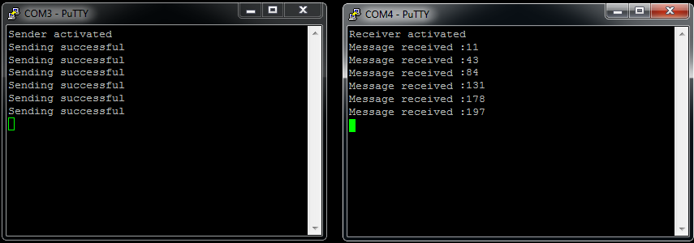

# Arduino-nRF24L01-radio-communication

## How it works ?

Sender is sending message with variable containing millis() `Time until board started` every 2 seconds. Receiver displays received value in terminal window. 

## Introduction
---

Hello, I am glad to see you reading this file. Code you are reading now is a simple example how to make radio communication using [nRF24L01+](https://www.sparkfun.com/datasheets/Components/nRF24L01_prelim_prod_spec_1_2.pdf) modules.
Any questions send via mail at : **boocianpawel@gmail.com**

# NRF24L01 setup

At the beginning you must include dedicated libraries for Arduino RF `RF24` and `RF24Network`. If you didn't have them yet, download in Atom terminal using command `platformio -g install "name"` . After this we are creating RF24 object called radio with params (7,8). Both figures means number of pin when nRF24L01+ module are attached. Then create RF24Network object using previous radio. Next step is creating device nodes in used radio channel, it is done here `RF24NetworkHeader uno_header(UNO_NODE);` where **UNO_NODE** equals 00.   It's Arduino Uno ID in radio channel used by our modules. We need to identify our devices in network. At the ned we need to set up network using command `network.begin(CHANNEL,UNO_NODE);`.

To send message NRF use network.write() method with 3 variables.Node who is sender,&message and third sizeof message. `network.write(sender,&message,sizeof(message))` 
To receive message we need to check if something is available. Use then **network.available()** If so, NRF use **network.read()** method with 3 variables.Node who is recipient (recipient == UNO_NODE) ,&message and third sizeof message. `network.read(recipient,&message,sizeof(message))`.
